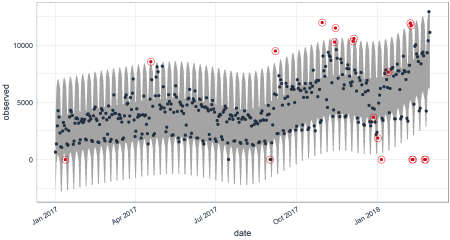

For the AI seminar, I am attending, I selected the following paper:

 _[Sean J. Taylor & Benjamin Letham (2018) “Forecasting at Scale”, The American Statistician](https://amstat.tandfonline.com/doi/full/10.1080/00031305.2017.1380080)_.

## Abstract

In the coming weeks, I want to evaluate the method described in the paper and see what can be accomplished with it in an
environment relevant to me. The relevant environment for me is time series, mostly business time series, but can be of
different sorts as well.

## Content

The paper "Forecasting at scale" describes the method that Facebook uses to do forecasting on time series data based
on an additive model where non-linear trends are fit with yearly, weekly and daily seasonality, plus holiday effects.
The procedure is robust to missing data and shifts in the trend, and typically handles outliers well.

## Motivation

I'm explaining my motivation behind selecting the paper:

### Why have I chosen this paper?

Last year I got a task when doing volunteering service for the country, to work on a time series data set. I built a
proof of concept system that could process the gigabytes of CSV files and aggregate the time series to different sample
durations. The time series were also transformed using different methods such as [CUSUM](https://en.wikipedia.org/wiki/CUSUM)
and [EWMA](https://en.wikipedia.org/wiki/EWMA_chart) to make them easier to interpret.
I visualized them with [Grafana](https://grafana.com/) that I connected to a self-written Python backend using [Flask](https://palletsprojects.com/p/flask/).
The processing of the data was limited to my dev machine and I was restricted from using any other infrastructure. Because
it became clear that single-thread processing would not finish the processing within days, I had to parallelize it with
[Dask](https://dask.org/), which shortened the processing time dramatically.

After visualizing the immense amount of data it became clear that we will find some seasonality and trend in subsets
of the time series. Thus I had the idea to decompose the filtered subsets into seasonality and trend. This gave the
opportunity to then create a prediction interval that can be used to find anomalies in the data.

After a quick and dirty implementation, it became clear that producing nice graphs could turn out to be tricky. A
colleague stumbled upon the [anomalize](https://cran.r-project.org/web/packages/anomalize/index.html) package in R.

We tried it out but concluded that special holidays, weekends and so on still were a problem for anomalize which uses
STL (Seasonality and Trend decomposition using LOESS, [Paper](https://www.scb.se/contentassets/ca21efb41fee47d293bbee5bf7be7fb3/stl-a-seasonal-trend-decomposition-procedure-based-on-loess.pdf))
and methods from Twitter's [AnomalyDetection](https://github.com/twitter/AnomalyDetection) library.

So our research continues and we found the library [Prophet](https://facebook.github.io/prophet/) which looked promising,
as it's method promises that it can not only cope with holiday effects but also work at scale, has automatic changepoint
detection and allows for Analyst-in-the-Loop Modeling.

But unfortunately the time we had run out and I had no chance to look at this method in depth. This AI seminar now gives
me the chance to catch up.

### Why is it relevant and interesting?

Facebook has developed the Prophet library in house and is sharing it as open source with the community. At my day job,
we're operating applications at scale and thus are confronted with the same problems that Facebook has tried to solve.

I think it can be interesting for larger companies trying to achieve application operating models that can do self-healing,
scale automatically using predictions, anticipate surges and find anomalies so an operator can have a closer look and
feed the result back into the model. Until 2025 we want to have AIOps established in the company. And we're certainly
not the only company trying to do this.

## Expectations & Goals

My goal of working through this paper and the accompanying library is to deepen my knowledge of how time series analysis
can be approached beside the methods I already know like STL. Also, I would like to be able to tell our business owners
and fellow coworkers if this method could be a useful tool.
