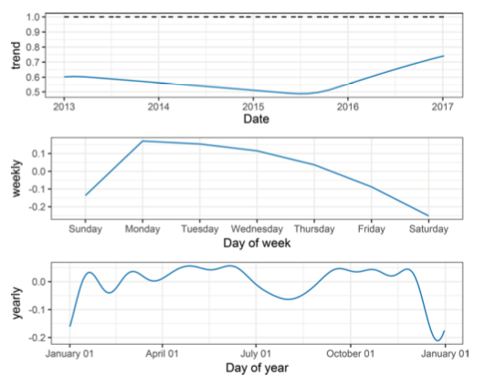

In this post I want to dissect a paper's style and try to criticize it irregardless of it's content.
The paper is the one mentioned in the previous post:

 _[Sean J. Taylor & Benjamin Letham (2018) “Forecasting at Scale”, The American Statistician](https://amstat.tandfonline.com/doi/full/10.1080/00031305.2017.1380080)_.

## Standard Structure

Let's go over the standard structure of a paper and describe what to look for, and then giving the verdict of how the
paper did.

### 0. Title

A good title for a paper should honestly reflect the content, give the reader hints what topics it will touch,
and reveals the category of the paper (argumentative, analytical, definition, compare and contrast, cause and effect, report.
interpretive, etc.).

Sometimes people working for big names put catchy titles on their papers such as "Attention Is
All You Need" or "One Model To Learn Them All". This yields that if that paper really is groundbreaking, people will
remember it for the catchy name, and it's easy to talk about it in colloquials. For the authors is a kind of branding
for them as they can afford to add a title like this. A researcher with their feet on the ground probably has to resort
to more bland titles that are humble and serve their purpose in the journal or conference.

**Verdict**: The title of the paper "Forecasting at Scale" is pretty short and does not summarize the techniques or methods
described in the paper and rather focuses on the fact that the paper is practical experiences made since the word "Scale"
is mentioned. So in my opinion it's a bit catchy but that's maybe in the nature of the authors since they work for Facebook
and can afford to have a title like that. It's clear the content will not be about biomedical topics or physics.
It could also be about weather forecasting if it weren't published in a journal named "The American Statistician".

### 1. Abstract

The abstract is the first thing a paper, and the part most often read. It should stand for itself and not require the
reader to read any other part of the paper to understand it.

The structure of an abstract is:

1. Problem: what is it and why it is interesting
2. Method: what and how is it accomplished
3. Result: what is the new achievement
4. Importance: what follows after the result

The abstract is for people that <ins>want</ins> to read the paper. It is not to be confused by the conclusion which is for
people that <ins>have read</ins> the paper.

**Verdict**: The abstract gives a nice introduction to the field of forecasting time series in the first sentence. It makes me
feel guided into the topic. The second sentence starts explaining the problem as it should mention according to our list
above. From then on the abstract still follows the structure but tends to say "we will describe in this paper" and not
actually giving the reader the result right there in the abstract. It's nicely rounded off by explaining where these
methods are now productively in place.

### 2. Introduction and Related Work

The introduction explains the problem in depth and why it's interesting and important. It also explains why naive approaches
usually fail and why other people have not solved it before and thus makes the problem hard. It should also introduce
the proposed approach.

This section should also include related work with a brief overview of the current state of the art with explanations
what is new with respect to previous work. It should be come clear what's the improvement.

**Verdict**: The introduction is in itself structured logically, and the reader can easily follow. It explains what they
mean by "scale".

In my opinion the paper's introduction and the main body diverge a little as the introduction explains scaling problems,
and the main body describes solutions to forecasting problems for the good first part.

They don't talk about why these problems have been solved by others though. They also don't mention
related work. I could imagine the reason being the other few companies that could encounter scales like Facebook don't
publish their results as white papers. Though I could also imagine the authors didn't care much about related research work,
since they were building a practical implementation that matches their company environment.

### 3. Main Body

This part should talk about formulation, implementation, results, experiments, etc.

The main body is a longer piece of content which should be grouped into sections. Ideally the text doesn't introduce
more than one idea per sentence or paragraph. A topic should be in its own section.

General good practice:

- use short words
- use short sentences with simple structure
- keep paragraphs short
- avoid buzzwords, clichés and slang
- avoid excess, in length or style
- omit unnecessary material
- be specific, not vague or abstract
- break these rules if there is a good reason to do so

**Verdict**: The main body is well-structured, sections are not too long, paragraphs have a reasonable length and contains
a good amount of visualizations. Details as to why they have chosen a certain method over another are often left out
as one can read the reasons in the respective paper, which I guess follows the principle of omitting unnecessary material.

### 4. Conclusions

The conclusion is a brief summary of the main findings and includes a discussion, perspective and future work etc.

**Verdict**: The conclusion doesn't go into any details anymore, which is good as it should be brief. What I'm missing from it is
some sort of critical questioning of the results. What the authors describe is only positive and that they are happy.
That's maybe what truly are. There's no mention of future work of possible improvements.

### 5. Acknowledgements

As the name says, in this part the authors acknowledge people that helped the creation of the paper.

### 6. References

References should be complete and relevant and correctly cited.

### 7. Appendices

This part is optional and sometimes used to append large figures, tables or code.

## Style Review

### Graphs, Figures and Tables

If you haven't heard about Edward Tufte, go read about his work now. He has produced some great literature about
statistics visualizations. He talks about information design (e.g. data-ink ratio), criticizes PowerPoint, encourages
small multiples (produce many small visualizations instead of one superimposed graph) and other techniques.

Other than that it should be clear that figures and tables should be easy to read and understand, show relevant data
and have a caption explaining them.

**Verdict**: The paper has some very good graphs, and some which are not that good. It seems they have been produced
in different styles. Generally I would like the visualizations to have a common style.

I take two examples:

**Good:** I like the color coding and the display of the seasonal effects of the weekdays. The main thing here to criticize
is the color choice for Saturday as it's barely readable. They could also reduce the grey background lines and increase
the data to ink ratio.

**Bad:** This figure looks less optimal. On the first chart I don't know what the dotted line is or why the other one is blue.
It is also dangerous to put three charts together implying they could be compared even they have different timelines
and should not be compared. Also, isn't weekly also a trend (referring to the y-axis descriptions).

# References

- Justin Zobel (2014) Writing for Computer Science, Third Edition, New York: Springer.
