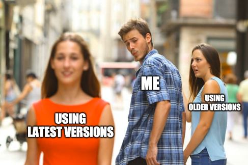
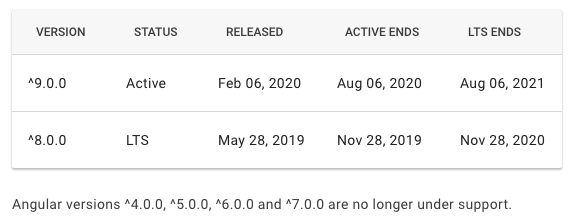

We tackle the question of why it's important to keep your dependencies up to date, compare a few proprietary
solutions and then talk about how to do it with NPM, Gradle and Jenkins yourself.



## Why it is important to keep your dependencies up to date

There are several reasons why you should keep the dependencies you use in your project up to date:

**Keep the burden of migrating small in case of incompatibilities:** If you do not regularly upgrade your dependencies
you will eventually have to and face a big list of breaking changes which do not take minutes to fix but hours, days or
weeks. By keeping your dependency versions close to the latest versions, you can upgrade in small steps, and the change
you need to do to your code base to make it compatible, is small each time. So, I prefer small incremental migrations that are easy
to be covered by a maintenance task in your backlog rather than big migrations that take up the whole Scrum sprint.
Because big migrations are harder to sell to your business owners than unnoticeable migrations.
If you wait too long with upgrades you might even stick with what you got. This is the first step to doom the code base,
as it's eventually going to be rewritten by fresh developers not accepting to work on a legacy code base.

**Profit from the latest features and performance improvements:** Keeping up to date comes with the benefit that you
can always rely on using the latest features the dependency provides and generate customer value in a modern, possibly
easier or more reliable and faster way. It keeps the developers working on the project happy to work with the newest
versions and allows them to brag to colleagues from the field that they are up to date.

**Ease of updating in case vulnerabilities get found:** Imagine a vulnerability gets found in one of the dependencies
you rely on to run your application. And the good thing is, the library owners have fixed the dependencies in the
latest version. But then you find yourself to be back 3 major versions which did not receive a patch to fix this
vulnerability. So, what are your options? You can upgrade the library and spend all the migration effort right there and
then and put everything else on hold, or just accept the risk. Neither are easy to sell to your business owner. If
you are using the latest versions of your dependencies, the upgrades cost you almost zero time.

### How recent should you keep dependencies

Generally, I would say that keeping your dependencies at the absolute latest version, including major, minor and patch is
the preferred way. Don't use betas, release candidates or other non stable versions.
Although using the absolute latest doesn't always make sense depending on several factors. If you're using libraries or
platforms that have a huge user base, it's likely the authors have different release channels for different users.

One release channel often is the Long-Term Support (LTS) channel offered. If the authors provide such a channel, it
generally is a good idea to stick to the LTS versions of the dependency you are using until the authors switch LTS to
a newer version. Examples for platforms or libraries offering LTS is: Java, Node.js, Angular, whereas for example Angular
has LTS for the two most recent major versions to allow you to upgrade within half a year to stay within LTS versions:



<p style="text-align: center">
<a href="https://angular.io/guide/releases#support-policy-and-schedule">Angular's support policy and schedule</a>
</p>

Once you upgrade your versions you should always verify your system works as before, doesn't have negative impacts and
maybe even measure if it profits from performance improvements mentioned in changelogs of the upgraded dependencies.
You should also have a look at what has been deprecated and will eventually be removed in a future version, which gives
you the benefit that you are aware of bigger migrations and lets you plan them ahead of time.

To verify compatibility a good test suite, ideally including unit and integration tests, comes into play. If you don't
have any or sufficient tests, you don't have enough confidence to update dependencies regularly. That's obviously a
problem, and you should look into increasing the coverage of your tests.

In any case, automated tests probably won't find 100% of problems, so I would say it's a good idea to upgrade major
versions just after your latest major rollout to production. If you use a branching strategy like [Git Flow](https://nvie.com/posts/a-successful-git-branching-model/)
that would mean you update on the `develop` branch. This allows for all testers and developers working on the
new version to experience the new major version of your dependencies during development. They can find incompatibilities
before you ship to customers.

## Dependency Update Automation Bots

There are several products offered on the Internet to automate dependency updates for you. Here's a list of a few of
them:

- [Dependabot](https://dependabot.com)
- [Renovate](https://renovate.whitesourcesoftware.com)
- [Snyk](https://snyk.io)

They work great, and work in the way, that they have a scheduled job to update your dependencies, create a pull request
and let you decide if you want the update or not. The problem with them is, that they are usually free for Open Source
projects on GitHub or other hosting platforms, but as soon as you want to automate updates for your closed source
project you have to pay, and sometimes these are considerable amounts. Sometimes they don't even support your existing
CI systems.

Luckily, there is no need to pay for these services, you can just build it yourself with all the control you want. The
following sections describe how I built dependency bots for our team.

## How to automate updates with your automation system such as Jenkins

The basic principle is that you have an automatically scheduled job run by your automation system, such as Jenkins,
that looks at your dependencies, does a diff with the package registry or repository and updates your files specifying
the new versions, then creates a commit on a new Git branch and pushes that to the Git repository. With the new branch
it will create a new pull request, at which point your CI system picks up the pull request and runs your tests against
it to see if they still pass. If you're happy with the updates, you merge the pull request and there you go. You can
now update your dependencies with a single click while having confidence they didn't break anything.

So, the question is, do you want exactly one job updating all of your outdated dependencies at once, or do you want to
introduce update groups. In my project, I decided to introduce 4 update groups:

- NPM packages: scheduled nightly against `develop` branch
- Major, Minor, Patch updates for Open Source Gradle dependencies: scheduled nightly against `develop` branch
- Minor, Patch updates for Open Source Gradle dependencies: manually triggered if needed against `master` branch
- Internal Gradle dependencies: scheduled every 6 hours against `develop` branch
  - In our project, we use software libraries from other teams of the company in our code that are updated multiple
    times per day, and we want to integrate with these changes just a few hours after they have been released.

The extreme choice would be to create update groups for every single dependency that you have. But I didn't do that,
because:

- Firstly, in NPM, several dependencies, such as Angular's, must be updated in accordance to be compatible
- Secondly, to spare our build infrastructure and not overload it with tests to execute, I decided to update dependencies
  that come from public sources every night and group those together in one group.

The drawback is, that if two dependencies are updated within one day and one of them breaks your build, you cannot
merge the pull request for the one dependency that works.

A script automating this could look like this for NPM:

```bash
#!/bin/bash

# create new branch and checkout
git checkout -b feature/npm-update

# do an install so we know what versions we have present
npm install ; EXITCODE=$?
if [ $EXITCODE -eq 1 ]; then
    echo "npm install failed!"
    exit 1
fi

# list outdated packages
npm outdated

# do the update
npm install ; EXITCODE=$?
if [ $EXITCODE -eq 1 ]; then
    echo "npm install failed!"
    exit 1
fi

# run npm install again to ensure package-lock.json is stable
npm install ; EXITCODE=$?
if [ $EXITCODE -eq 1 ]; then
    echo "npm install failed!"
    exit 1
fi

# stop if there are no changes
if git status | grep -q "working tree clean" ; then
    echo "No updates available! That's good :)"
else
    git add -A
    git commit -m "(deps) update npm dependencies"
fi
```

Then add these two steps as post actions:

- Either add a `git push` command, or in case of Jenkins run the [Git Publisher plugin](https://plugins.jenkins.io/git/#git-publisher) to publish the branch.
- Add code that automatically creates a Pull Request in your Git repository.

## How to automatically update NPM dependencies

If you want to automatically update your NPM dependencies, you already have the tools from NPM itself, no need for other
plugins. You can run `npm update` to update the versions in your `package.json` file according to the version selector
you have defined.

If you don't know about NPM's version selectors syntax like `^`, `~` and others, I encourage you to try out the
[playground](https://semver.npmjs.com) to learn about it. If you want a default save prefix for new packages installed,
you can create a `.npmrc` file in your project directory with the line `save-prefix="~"` added to it. This changes
the default `^`, that allows updates to new minor versions to `~`, which only allows updates to new patch versions.
That's not something I would recommend doing, as that would restrict your updates more. If you use `save-prefix=">="`,
every time `npm update` is run, you get the newest production ready version (don't worry, you won't get betas,
release-candidates and so on).

Another thing to note is that NPM only updates direct dependencies that you specified in your
`package.json` file. Transitive dependencies (dependencies of your dependencies) will not be updated. You can include
transitive dependencies with `npm update --depth 9999`. I would actually not recommend doing this on a nightly basis,
because the amount of updates you will receive is going to be immense. So, I would resort to only let your direct
dependencies specify their minimal versions of transitive dependencies and not update them yourself. The exception might
be when one of the transitive dependencies have vulnerabilities, and you want to fix them in your application before the
direct dependency is updated.

By the way, the recommended depth 9999 by the [NPM documentation](https://docs.npmjs.com/cli-commands/update.html) failed
in my project because NPM ran out of memory. So, you might want to scale it back to a safe depth like 10.

So, all you need is:

- `npm outdated` to print outdated versions
- `npm update` to automatically update them

## How to automatically update Gradle dependencies

If you're using Gradle to manage your dependencies for Java, Kotlin or Groovy projects (or others?), then there's no
built-in way to update your dependencies, but there are great plugins to do so.

I'm actually using two plugins; one depends on the other.

The plugin [gradle-versions-plugin](https://github.com/ben-manes/gradle-versions-plugin) is able to compare your versions
to the versions available in the specified artifact repositories. It adds the task `dependencyUpdates` to your
configuration which outputs the versions that can be updated in various formats.

The second plugin [https://github.com/patrikerdes/gradle-use-latest-versions-plugin](gradle-use-latest-versions-plugin)
is then able to take the output of gradle-versions-plugin and find these versions in your `build.gradle` file(s) and
replace it with the new version.

Additionally, you can configure exactly what updates you want, and what you don't want through configuration in the
Gradle files or through command line arguments.

In our `build.gradle` file I added the following snippet to keep non stable versions and allow them to update to newer
non-stable versions but keep dependencies that are using stable versions today remain on stable versions.

Also, I added in an optional property `onlyMinorPatchUpdates` for minor updates. I run the update job with this property
against branches that contain code already shipped to production, since I don't want to introduce new major versions
there.

```groovy
tasks {
    dependencyUpdates {
        // consider BOM version definitions and do not complain about transitive constrained out-of-date versions
        checkConstraints = true

        def isNonStable = { String version ->
            def stableKeyword = ["RELEASE", "FINAL", "GA"].any { word -> version.toUpperCase().contains(word) }
            def regex = /^[0-9,.v-]+(-r)?$/
            return !stableKeyword && !(version ==~ regex)
        }

        def getMajorVersion = { String version ->
            return version.substring(0, version.indexOf('.'))
        }

        def isMajorUpdate = { String versionA, String versionB ->
            return getMajorVersion(versionA) != getMajorVersion(versionB)
        }

        rejectVersionIf { component ->
            if (project.properties.get("onlyMinorPatchUpdates") == "true"
                && isMajorUpdate(component.candidate.version, component.currentVersion)) {
                return true
            }
            return isNonStable(component.candidate.version) && !isNonStable(component.currentVersion)
        }
    }
}
```

---

I hope this article was useful to you. If you have any remarks, questions or recommendations, feel free to leave
a comment.
