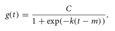
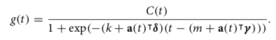
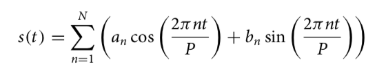
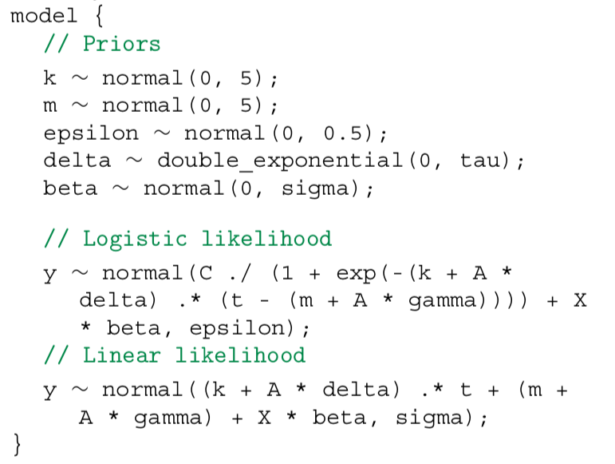
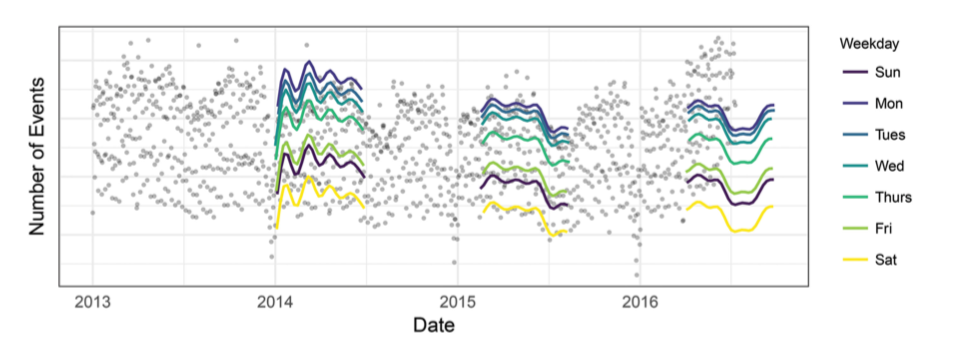

This is my third blog post about the paper
 _[Sean J. Taylor & Benjamin Letham (2018) “Forecasting at Scale”, The American Statistician](https://amstat.tandfonline.com/doi/full/10.1080/00031305.2017.1380080)_.

I'm going to focus on its contents and try to place it in the field of forecasting and business time series.

## Business Time Series

Most large corporations process a lot of interesting data in the form of Business Time Series. These can be customer
related such as purchases, interactions through consultations, support, incident reports, usage of the service and so
on. They can also be about internal processes that cannot be attributed to a single customer, such as infrastructure
providing services to multiple customers.

These time series can provide insights on how the company performed in the past but also provide the foundation to
create forecasts. The paper "Forecasting at Scale" provides the reader with practices proofed in
the real world because they have been applied at Facebook. If the proposed methods work outside of Facebook and are
applicable to other organizations has to be found out.

## Preliminary reading

I'm going to list a few topics that you should be familiar with in case you decide to read the paper.

- Linear Regression, Advanced Regression Methods, Exponential Smoothing Methods, Bayesian Statistics, Fourier Series,
  [STL](http://bit.ly/stl1990)

If you want to reproduce the results of the paper, I recommend you are familiar with:

- [Stan](https://www.jstatsoft.org/article/view/v076i01), [R](https://www.r-project.org/), [Shiny](https://shiny.rstudio.com/)

## Assembly of Ideas

The paper has the main idea to assemble several methods into a scalable forecasting system. So what are the ideas
that the authors have assembled to build this system of scale?

- A forecasting model
- Automatic evaluation of forecasts

## The [Prophet](https://facebook.github.io/prophet/) Forecasting Model

As we know from the STL paper (Seasonal and Trend Decomposition using Loess), one can try to decompose a time series
into trend and seasonality components using Loess regression.

**Trend**

The mathematical expression to compute the nonlinear, saturating growth trend in its most basic form is

with C the carrying capacity, k the growth rate, and m an offset parameter.

This gives us a formula that supports a static carrying capacity and static growth rate. In the real world capacity and
growth rate are often not static and need to be dynamic. We can replace the carrying
capacity with an analyst-specified dynamic capacity function based on time. The growth rate can be replaced with a vector that contains the
manually specified change points with the respective growth rate of that time interval. This gives us the new formula

Sometimes we only need a piecewise linear model. This formula can be reused when simplified. It will give us a linear trend
with change points by removing the carrying capacity, and a constant growth replaced by rate adjustments.

The uncertainty of this model is computed by using it generatively, after having inferred the model parameters, to
forecast the future, while assuming the rate of change points is going to have a similar average cadence. We can repeat
the generation while sampling the model parameters from a Laplace distribution and create an uncertainty region.

**Seasonality**

Since seasonality in the real world is mostly a composition and does not have a fixed window in which it repeats, it
can be flexibly modeled using Fourier series. If we have different components for different periodic effects, such as
yearly, holiday or weekday components, we can create an additive model based on that.

A standard Fourier series can approximate arbitrary smooth seasonal effects with:

**Fitting**

The complete model can be fitted in Stan:

The analyst creating a fit has to tweak the model parameters to reach the right compromise between loss and
overfitting. An analyst has settings to adjust capacities (C), change points (X), holidays and seasonality (A, gamma) and
smoothing parameters (tau, sigma). Often times this requires a broad experience in the business field to come up with
good model parameters. This can for example be because the analyst has to have a feeling for the impact of an upcoming
holiday in terms of trend or seasonality change.

The analyst is supported by visualization that show the effects of the latest changes to their model:

## Automatic Evaluation of Forecasts

The analyst can optimize a model given time. If there are too many forecasts that have to be produced that can be
handled by humans, the automatic evaluation of forecasts comes into play.

The metric used to compare models is the mean absolute percentage error (MAPE) over a number of forecasts produced with
different prediction horizons.

Time series data points are inherently dependent on previous points. This is making it hard to use traditional methods
such as cross-validation. The method proposed is Simulated Historical Forecasts (SHFs), that produce K forecasts at
various cutoff points in the history. The generally used amount of points is a forecast every H/2 periods. This allows
the model to produce an error term using MAPE which can be compared to baseline models.

Time series data usually encompasses a lot of data points and running SHFs with the maximum amount of periods would not
be feasible as the model needs to be retrained each time. With SHFs, the simulation count is significantly reduced and
the computation can be run independent on separate machines.

## Paper Context

The paper "Forecasting at Scale", picks up common knowledge that the field of business time series has been using for
quite some time but mix it with other techniques to solve new challenges while making it scalable and allowing the
analyst to be in the loop.

In my opinion the value the paper creates in the field is not the paper, but the companioning library [Prophet](https://facebook.github.io/prophet/) which
makes all those techniques readily usable for a broader audience. The paper is worth a read if you're going to use the
library. If you're not planning that have a go with it, I can still recommend it as there might be some smallish novel
ideas introduced that you might find interesting. If you are already well versed in the time series field, I would say
that this paper is not going to contain much new for you.

## Paper Follow ups

The library [Prophet](https://facebook.github.io/prophet/) is under active development for over a year now. The open source community contributes to future
improvements to the code. The basic methods mentioned in the paper implemented haven't been changed though. So I'm
guessing that they are a good fit for the real world.
