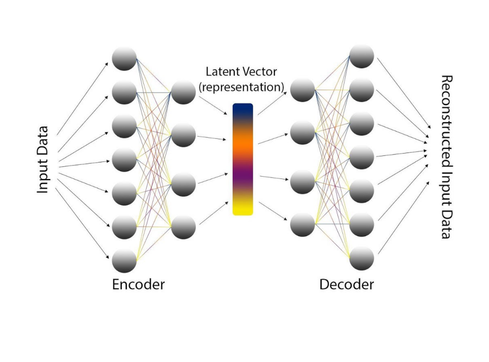

In [my first blog post related to the AI seminar](../0002-ai-seminar-intro) that I took, I laid out my
learning goals. Now the seminar is coming to an end, and I will try to assess my own performance and review
if the goals have been met.

## Goal Verification

Here are the goals once again. So, let's go through it.

### 1. I want to _know_ in detail how the process of writing scientific papers is like and hear from an expert that has experience in this.

Thanks to our lecturer who is a journal editor himself, I learned a lot of the process that scientific papers go
through, and I'm grateful for those insights. And by practicing certain aspects of the process myself, such as reviewing
a paper, I got to understand the details of it as well.

:100: goal fulfilled

### 2. I want to _try_ criticizing a paper and get feedback.

In my last blog post I [reviewed](../0007-forecasting-at-scale-review) the paper I was reading. During this activity
I had to research the actual structure of a review, and I think I captured it well. And I also learned about how others
approach this activity.

During our session we talked about the reviews, and I got a bit convoluted with what I could actually improve. My note
taking was sub-par at that point which is why I'm now unsure how I faired.

:white_square_button: goal fulfillment unsure

### 3. I want to _refine_ my writing skills.

Writing blog posts for a broader audience definitely helped to refine my writing skills.
Each time I dedicated a lot of thinking time into the structure of the post. My process was as follows:

1. Lay out the structure of the post. The question I asked myself was, how should the reading journey be like? How do we
   start and how do we end? What does the audience expect? I also did some research how similar posts are structured and
   if I can improve on that.
1. Fill in the created sections with bullet points of what I want to write about. This helped me to understand at an
   early stage if the flow of the post will make sense in the end. So here I also reviewed the structure again and made
   some readjustments.
1. On a different day, the next step would be to fill in the sections with prose text, images and references. While
   writing, I often did research and looked for interesting graphics or references.
1. My last step is proof-reading and ensuring the post forms a whole and sentences or paragraphs are not dangling.
1. Publish

I learned that reading the sentence that I wrote again on a different day usually gives me ideas on how to improve it to
support the reading flow of the reader. I'm still having trouble to stay away from passive sentences though.

[Looking at the writing style](../0004-dissecting-paper-style) of the paper I read was also helpful, as I think
it's style was quite good, and I identified the parts that were not so good.

:100: goal fulfilled

### 4. I want to _get to know_ the method explained in my chosen paper in detail.

I think now I understand the contents of the paper "Forecasting at Scale", because I not only did a skimming read, a
thorough read and reading of surrounding literature, I also summarized it in a [blog post](../0006-forecasting-at-scale-content)
and held a short presentation.

One could look at this process of summarizing like an autoencoder. A summary should be shorter than what
you are trying to summarize, otherwise it's not a summary. So somehow you have to make it shorter, and you do this by
compressing information down. The person reading the summary should still be able to grasp the content of the original
paper with some slight imprecision when filling in the gaps in their own mind. That's exactly what an autoencoder
architecture would accomplish as well. So the summarizing process is figuring out what parts have to be encoded into the
summary for a possible decoding to be successful.

Image Source: [mc.ai](https://mc.ai/variational-autoencoders-an-intuitive-explanation-some-keras-code-2/)

In turn I discovered the key points of the paper and internalized it for myself.

:100: goal fulfilled

### 5. I want to _establish_ a regular blogging habit beyond this seminar.

I can't judge this goal just yet. I have written one post that is not related to the seminar as yet and I have
more topics in my queue. I sure hope I will find the motivation to keep this going. I clearly see the benefit of doing
so.

:white_square_button: goal fulfillment not possible yet

### 6. I want to _share_ my learning process and gain insights how others do the same.

Through this blog and colloquial sessions with my peers and lecturer I was able to share my learning process. This blog
post itself is the culmination of it.

:100: goal fulfilled

## Comparing myself to others

I was not the only one participating in this seminar, and we were specifically asked to compare our performance to
others.

Here I will split my comparison into the different parts that we participated in:

- **Blog Posts**: I tried to make my posts as enjoyable to read as possible with a reasonable time amount spent writing
  them. As I plan to continue using this blog as my personal blog for the foreseeable future, I always had in mind
  writing for a broader audience that is not exclusively limited to participants of the seminar. I was always impressed
  by what the others created and tried to learn from their good efforts and tried to improve upon. Unfortunately I
  almost never published my posts very early, which is why my colleagues had little to no time to read it before our
  sessions. So I would give myself a negative rating for the timeliness, but an above-average rating for the content
  itself compared to others.
- **Session Participation**: I came reasonably well prepared into the sessions, having read the emails and slides from
  last time, the additional resources and the posts of the others. I enjoyed the sessions as they were focused and
  required one to be "present" with their mind. I think all participants did well.
- **Presentations**: The long-ish presentation is still ahead of me. The few things I presented were ok-ish. At one time
  I was confused as what to present, because we were asked to prepare to present the findings of our writing style
  analysis and then in the session we were asked to present the content (without having thought about how to present it).
  I also think all participants did well in this regard.

## Learnings Summary

So, I learned to:

- read / understand a scientific paper
- obtain more information / do literature research
- put research in context (with respect to current state of the art in the field)
- form my own scientific opinion / judgement
- present scientific results in different ways (blog, orally, presentation, written document)
- engage in a scientific discussion, express my view, formulate criticism

---

I can highly recommend this seminar to any other fellow students that might be reading this blog, thinking about
enrolling. The university internal name of the course is "EVA Artificial Intelligence Seminar".
