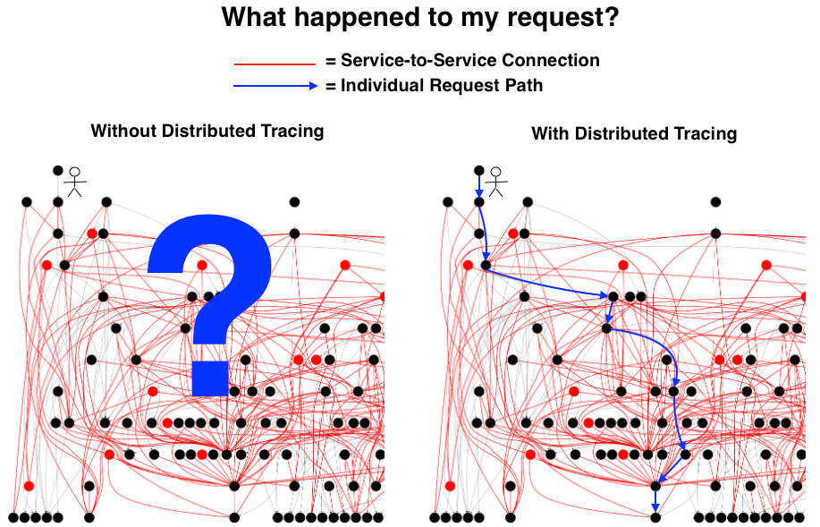

## Distributed Tracing

Distributed Tracing enables us to follow invocations across services and monitor them. We can observe a single service using logs and metrics. But what if we have a chain of services that fulfill a single purpose for an end user? For example if we have a user that clicks on an order button in a web frontend, we call the frontend's backend BFF (I personally favour the **B**ackend-**f**or-**F**rontend pattern) which internally calls an inventory microservice to see if the product is available, and also calls a billing microservice to get the user's bill they will need to approve. If the billing service returns an error, the BFF returns an error to the user. However the inventory microservice returned a successful response. If we only have logs and metrics, we do not know what we just described, we simply know there were some errors, but their correlation is not given. With tracing we know that an error in a service very likely lead to another error in the consumer service if they are in the same recorded trace.


Source: https://medium.com/nikeengineering/hit-the-ground-running-with-distributed-tracing-core-concepts-ff5ad47c7058

A trace has an ID and consists of one or more spans. A span has an ID, timestamp, duration, a local and a remote endpoint as well as a name. For REST calls we traditionally use the HTTP method and path as the span name, e.g. `GET /info`. So, how can we collect spans that form a trace from different services running in different containers? The service that starts a trace is generating a trace ID and with every request it creates in the trace context, it not only creates a span, but it also sends the generated trace ID as an HTTP header. Zipkin specified the span propagation headers first and termed them `B3`.

```
   Client Tracer                                                  Server Tracer
┌───────────────────────┐                                       ┌───────────────────────┐
│                       │                                       │                       │
│   TraceContext        │          Http Request Headers         │   TraceContext        │
│ ┌───────────────────┐ │         ┌───────────────────┐         │ ┌───────────────────┐ │
│ │ TraceId           │ │         │ X-B3-TraceId      │         │ │ TraceId           │ │
│ │                   │ │         │                   │         │ │                   │ │
│ │ ParentSpanId      │ │ Inject  │ X-B3-ParentSpanId │ Extract │ │ ParentSpanId      │ │
│ │                   ├─┼────────>│                   ├─────────┼>│                   │ │
│ │ SpanId            │ │         │ X-B3-SpanId       │         │ │ SpanId            │ │
│ │                   │ │         │                   │         │ │                   │ │
│ │ Sampling decision │ │         │ X-B3-Sampled      │         │ │ Sampling decision │ │
│ └───────────────────┘ │         └───────────────────┘         │ └───────────────────┘ │
│                       │                                       │                       │
└───────────────────────┘                                       └───────────────────────┘
```

See [B3-Propagation](https://github.com/openzipkin/b3-propagation) to learn more about B3 headers. Other vendors followed suit with their propagation format, which meant there were suddenly multiple out there. Nowadays, it's best practice to follow the [Trace Context W3C Recommendation](https://www.w3.org/TR/trace-context/). If unsure, or during migrations, you can include different propagation headers in your requests, as they don't bite each other.

The service answering this request picks up the headers and does not generate a new trace ID, but instead uses the provided trace ID. If this service calls yet another service, it simply passes on the trace ID it received. This is handled by instrumentation libraries and a developer usually does not have to care about this, except configuring the tracer library. OpenTelemetry provides state of the art implementation libraries that we can use. They provide compatibility to OpenTelemetry Collector, Prometheus, Jaeger and many others and support different transports (TCP, gRPC, UDP) and different deployment models (in-application, agent, ...).

So, each service now knows to which trace its spans belong to, but how do we collect this information? This is where the Collector comes in. We could tell our services to send the spans to an OpenTelemetry Collector or to a Jaeger collector or any other collector that we'd like. Given the common trace ID, the tracing backend can then correlate the spans together and display them in a single timeline. Sending spans in batches to a collector can impact your service's performance, so there are options to also do this using a sidecar / agent approach, which involves running another process on the same host next to the service container or even a process running in the same container using process daemons.


Tracing data is complementary to logs and metrics and does not replace them.

Using tracing data, we can also visualize system architectures based on actual data in realtime. Especially with microservices and with chaos engineering, your system architecture diagrams will quickly be outdated. We can analyze the local and remote endpoints of each span and determine the direction of communication between two services. Aggregated over all spans we get a dependency map. If we index this data we can even query for the map during a time frame and even visualize throughput and error rates on edges between services.


## Tools

**Instrumentation:**

- [OpenTelemetry Instrumentation](https://opentelemetry.io/registry/?component=instrumentation) **\*recommended**
- [Jaeger](https://www.jaegertracing.io/docs/1.36/client-libraries/) - deprecated
- [Zipkin](https://zipkin.io/pages/tracers_instrumentation.html) - deprecated
- [AWS X-Ray](https://docs.aws.amazon.com/xray/latest/devguide/xray-api.html)

**Collecting:**

- [OpenTelemetry Collector](https://opentelemetry.io/docs/collector/) **\*recommended**
- [Jaeger](https://www.jaegertracing.io/) - preferred over Zipkin
- [Zipkin](https://zipkin.io/) - first one to be widely adopted
- [AWS X-Ray](https://docs.aws.amazon.com/xray/) - if you're running services on AWS

**Analysis / Post-Processing:**

- [Jaeger](https://www.jaegertracing.io/) - supports wide range of storage backends, decent UI **\*recommended**
- [Zipkin](https://zipkin.io/) - first one to be widely adopted, scaling issues, UI bugs
- [AWS X-Ray](https://docs.aws.amazon.com/xray/) - if you're running services on AWS, automatic integration into lots of AWS services

Others: [Tanzu Observability](https://tanzu.vmware.com/observability), [Dynatrace](https://www.dynatrace.com/), [Azure Application Insights](https://docs.microsoft.com/en-us/azure/azure-monitor/app/app-insights-overview), [Azure Monitor](https://docs.microsoft.com/en-us/azure/azure-monitor/overview), [Graphite](https://graphiteapp.org/), [Datadog](https://www.datadoghq.com/), [Google Cloud Monitoring](https://cloud.google.com/monitoring), [Lightstep](https://lightstep.com/), [Logz.io](https://logz.io/), [Sentry](https://sentry.io/), [Splunk APM](https://www.splunk.com/en_us/products/apm-application-performance-monitoring.html)

## System Architecture

My personally recommended architecture looks like this:


The service, of which there can be many, is deployed using an agent (if available for the language and framework). This is then sending the tracing data (and metrics) to the OpenTelemetry collector, which has a configured pipeline to receive spans and forward them to the Jaeger collector, which stores it in a storage backend such as an Elasticsearch database. The Jaeger Query service allows an engineer to query the traces and visualize them.

## Upcoming

This post is part of a series around OpenTelemetry. See the other posts in this series:

- [Introduction to OpenTelemetry](../0011-opentelemetry-intro/)
- Introduction to Distributed Tracing (**this article**)
- OpenTelemetry Collector Components (upcoming)
- OpenTelemetry Instrumentation (upcoming)
- Instrumenting React.js applications (upcoming)
- Instrumenting Angular applications (upcoming)
- Full Stack OpenTelemetry Example (upcoming)
