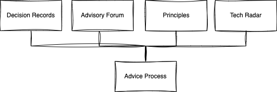

Central Architecture as executed by a single architect or a group of architects has three main problems:

- **Bottlenecks** — Having a central authority which designs architectures or even if it only has to approve it, slows down delivery.
- **Ivory Tower** — The central authority does not have to live with the consequences. Neither does a birds eye view suffice to solve problems adequately, because the devil is usually in the details. 
- **Conway’s Law** — The organization structure defines the architecture. Designing without being inside the organization is not possible. The result will be different.

This post discusses how to decentralize architecture to address these problems.

The content is a summary of the excellent blog post by Andrew Harmel-Law [Scaling the Practice of Architecture, Conversationally](https://martinfowler.com/articles/scaling-architecture-conversationally.html).

## Decision-making via the “Advice Process”

This is the most fundamental change.

**The Rule:** anyone can make an architecturally significant decision [1].

**The Qualifier:** before making the decision, the decision-taker must consult two groups: The first is everyone who will be meaningfully affected by the decision. The second is people with expertise in the area the decision is being taken.

[1] An architecturally significant decision is one that is hard to change later, has a significant impact on the system, and is not obvious. See [Architectural Significance](/0014-architectural-significance) for more.

We are not looking for consensus here, but we are looking for a broad range of inputs and voices. Decision-takers are encouraged to specifically seek out those who will disagree with them.

When deployed, decisions are better, faster, more accountable, and most importantly decisions which are understood and owned by those who implement them, precisely because the decision-taker is the one with the need as well as the one who is accountable.

The traditional architect now plays the role of a Guide, drawing on their experience in the field.

> [In order for an architecture to be successful] it is very much about ensuring that conversations that are needed to be happening are happening - not always initiating them, nor always helping to focus or navigate them, but ensuring they do happen […] and guiding when needed
>
> — [Ruth Malan](https://web.archive.org/web/20201222143814/https://www.ruthmalan.com/Journal/2016/2016JournalFebruary.htm#Still_Need_Architects)

Also check out this excellent talk: [Architecture without Architects - Erik Dörnenburg](https://www.youtube.com/watch?v=qVyt3qQ_7TA)

## The Four Supporting Elements

The Advice Process requires four elements to be implemented successfully:

- a thinking and recording tool → Architectural Decision Records
- a time and place for conversations → Architecture Advisory Forum
- a light to illuminate and guide towards a unified direction → Team-sourced Architecture Principles
- a means to sense the current technical landscape and climate → Tech Radar

The Core and Supporting Elements of Decentralized Architecture

## Architectural Decision Records (ADRs)

> A thinking and recording tool

ADRs are lightweight documents per decision taken that was architecturally significant.

Elements of an ADR when used in an advice process context:

| Name               | Description                                                                                                                                                                                                                                                                                                                                              |
|--------------------|----------------------------------------------------------------------------------------------------------------------------------------------------------------------------------------------------------------------------------------------------------------------------------------------------------------------------------------------------------|
| Title              | Which includes a unique identifier, and the decision itself (e.g. “ADR001 - Use AKS for Kubernetes Pods”)                                                                                                                                                                                                                                                |
| Status             | Typically “Draft”, “Proposed”, “Adopted”, “Superseded” and “Retired”                                                                                                                                                                                                                                                                                     |
| Decision           | The decision that has been taken in a few sentences (frequently bold or italicized so it stands out)                                                                                                                                                                                                                                                     |
| Context            | The forces and current contextual circumstances which have necessitated this decision                                                                                                                                                                                                                                                                    |
| Options Considered | Each option considered, described briefly, with pros and cons. (Typically the option proposed / adopted comes first in this list)                                                                                                                                                                                                                        |
| Consequences       | The ramifications of this decision, both positive and negative                                                                                                                                                                                                                                                                                           |
| Advice             | This reflects the raw outputs from following the Advice Process. It is here that all advice given is recorded. This ought to include the name of the advice giver, and the date the advice was given. This can frequently take the forms of comments, and if these are provided directly by the advice-giver, then recording the meta-data is automatic. |

## Architecture Advisory Forum

> A time and place for conversations

The Architecture Advisory Forum is a regular and recurring place and time for conversations.

**Goals:** High quality architecture conversations take place in a timely fashion. Equally important is the breadth and diversity of views shared, and the same goes for the contributors. The goal is to “do” architecture and share and learn lessons.

**Attendees:** Ideal attendees are delegates from each team as well as key representatives from the Advice Process. However, the invite should remain completely open to encourage transparency and openness.

## Team-sourced Architectural Principles

> A light to illuminate and guide towards a unified direction

What are good principles?

- Clear Direction — You should be able to make a decision based on the principles, almost like an algorithm.
- Timeless — They should not change often.
- Universal — They should apply to a variety of situations.

The set of principles should cover the key needs, and should not be too many that the teams cannot remember them all — and crucially the teams need to feel a sense of ownership.

Important: 

- Principles are not Practices (such as TDD, Trunk Based, Pair Programming).
- Principles should not be too general (such as Write Good Code)

Example: [John Lewis IT Software Engineering Principles](https://web.archive.org/web/20220630013441/http://engineering-principles.onejl.uk/)

## Tech Radar

> A means to sense the current technical landscape and climate

The Tech Radar is a tool to help teams understand the current technical landscape and climate.

To build your radar there are a few tools:

- [Thoughtworks - Build your own Radar](https://www.thoughtworks.com/radar/byor)
- [Backstage Tech Radar](https://github.com/backstage/backstage/tree/master/plugins/tech-radar)

Or just use Miro or any other collaborative diagramming tools.

In a context with a wide variety of technologies, it can be useful to have a radar per technology area.

## Conclusion

Decentralized Architecture is a powerful way to scale architecture in an organization. It is not a silver bullet, but it is a way to ensure that the right conversations are happening, and that the right decisions are being made.
