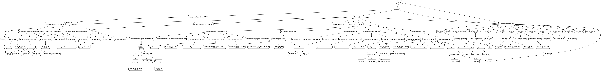

Ever wanted to understand the dependency graph in a Maven project with sub-modules?

1. Add the following to the parent pom.xml:

```xml
<project>
  <build>
    <plugins>
      <plugin>
        <groupId>com.github.ferstl</groupId>
        <artifactId>depgraph-maven-plugin</artifactId>
        <version>4.0.3</version>
      </plugin>
    </plugins>
  </build>
</project>
```

2. Run `mvn depgraph:aggregate -DcreateImage=true [-Dincludes=groupId:artifactId]`
3. The graph can be found at `target/dependency-graph.png`

Documentation: https://github.com/ferstl/depgraph-maven-plugin

## Example



(Click to enlarge)
