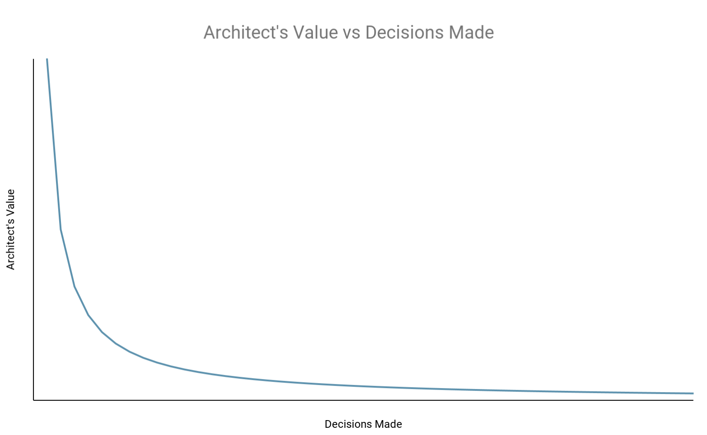
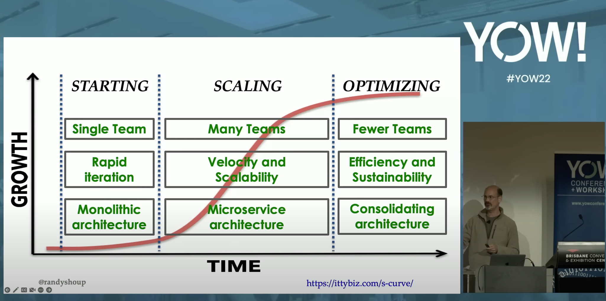

This blog post reflects my thoughts on what is architecture, what does an architect do and what they should focus on. I copied in some quotes which I found enlightening. The sources can be found in the references. It is also extending the thoughts from this older post: [Decentralized Architecture](/0014-decentralized-architecture).

## What is Architecture?

- Is architecture the taking of Important Decisions? → Important is what an expert developer declared as important. Therefore, importance is actually not a useful criteria for architecture.
- Is architecture the Decisions to be made early? → Decisions to be made early can be eliminated. Therefore, it is not decisions to be made early.
- Is architecture the Decisions hard to reverse? → Yes. Therefore, try to make decisions easy to reverse; reduce the number of hard to reverse decisions.

Therefore, get rid of architecture itself.

## Getting rid of Software Architecture

The following three quotes are from [Who Needs Architects — Martin Fowler](https://www.martinfowler.com/ieeeSoftware/whoNeedsArchitect.pdf).

> It’s commonly believed that if you are building an enterprise application, you must get the database schema right early on because it’s hard to change the database schema—particularly once you have gone live. On one of our projects, the database administrator, Pramod Sadalage, devised a system that let us change the database schema (and migrate the data) easily.

→ We have to find abstractions to make changes easy.

> Complexity is what makes software hard to change. That, and duplication.

→ We have to simplify.

> Software is not limited by physics, like buildings are. It is limited by imagination, by design, by organization. In short, it is limited by properties of people, not by properties of the world. “We have met the enemy, and he is us.”

→ Hard to reverse decisions can be converted into easy reversible ones.

## What do Architects do?

Improving the development team's ability gives an architect much greater leverage than being the sole decision maker and thus running the risk of being an architectural bottleneck.

→ An architect's value is inversely proportional to the number of decisions they make.
→ An architect best acts like a guide (as in mountaineering guide) and not as decision maker.

## Implications

### Principles

These principles directly relate to the discussed topic:

- [Small and Simple](https://engineering-principles.jlp.engineering/principles/design/small-and-simple/)
- [Evolutionary Systems](https://engineering-principles.jlp.engineering/principles/design/evolutionary-systems/)
- [Design for Emergent Reuse](https://engineering-principles.jlp.engineering/principles/design/design-for-emergent-reuse/)

### Architect’s Activities

- Ensuring that conversations that are needed to be happening are happening
- Ensuring decisions are of high quality
- Guiding when needed
- Reducing irreversible decisions

### How can an architect do that?

- Conversations happen & decisions are of high quality (see [Decentralized Architecture](/0013-decentralized-architecture)):
  - A thinking and recording tool: Architectural Decision Records (ADRs)
  - A time and place for conversations: Architecture Advice Forum
  - A light to illuminate a unified goal: Engineering Principles
  - A tech landscape and current climate sensing tool: Tech Radar
- Guiding when needed:
  - Show presence
  - Connect people
  - Be available
  - Be useful
  - Act timely on guidance requests
  - Be cautious about decisions made in the dark
  - Reflect and and distill principles with teams
- Reducing irreversible decisions
  - Promote principles
  - Be cautious of irreversible decisions and guide towards reversible ones
  - Spend time thinking about abstractions to create systems with “reversability” built-in.

### Approach

Let’s use a city analogy:

- We can design the blueprint for a single building in a city.
- Or we can plan the layout of the entire city, including roads, buildings, and utilities.

If buildings are small and simple and can be extended easily, i.e. are built with evolution in mind, we maximize reversible decisions whenever we want to change the building or even demolish it.

So, how can we foster buildings being built this way that satisfies these properties? We can guide each building builder to design their building to satisfy these properties, but that takes time and leads to bottlenecks.

What if we instead build the best infrastructure for buildings? The provided infrastructure acts as a virtual restraint for the buildings. If there is a water pipe provided, the building builder is unlikely to pump water out of the ground and build their own water treatment plant, they’ll just use what’s already provided. This requires that the infrastructure is flexible, extensible and reliable.

Fostering an environment where systems are built with evolution in mind and where reversible decisions are maximized is crucial for adaptability and scalability.

To achieve this:

- **Every component must be simple.** Software and system components should be modular and loosely coupled, allowing for easy replacement or modification without disrupting the entire system.
- **Off-the-shelve solutions and standards are so good, they do not need enforcement to be adopted.** Frameworks, protocols, and interfaces promote interoperability and reduce the need for custom solutions.
- **Allowing focus on what matters for the business.** Automation tools and processes streamline development, testing, and deployment, enabling rapid iteration and evolution of software systems.
- **Have shared understanding.** Clear documentation and effective communication channels ensure that design decisions are well-documented and understood, facilitating future modifications and enhancements.

### Minimal Viable Architecture

In his talk [Minimal Viable Architecture](https://www.youtube.com/watch?v=9Q7GANXn02k), Randy Shoup explains that there are roughly three phases when building a system:

The city analogy is generic, and one has to understand in which phase the system is in.

The city analogy is more fitting for the scaling phase, where the focus is on building the best infrastructure for buildings.
In the starting phase, the focus is on building the best building. In the optimizing phase, the focus is on consolidating the buildings.

In other words:

- in the starting phase, focus on software architecture is more important.
- In the scaling phase, focus on system architecture is more important.
- In the optimizing phase, focus on software architecture is more important again.

During the scaling phase, a greater focus on system architecture as in platforms, infrastructure, automation, tooling, conventions, nudging, processes, and facilitation all with the goal to make decisions more reversible is likely to provide greater positive impact in a world where time is limited.

Striking the balance is still necessary though, it’s just the that there is more weight on system architecture.

To find the right balance follow this in this order:

1. Align with Business Goals
2. Manage Risks
3. Consider Reliability and Quality Aspects
4. Use Feedback-driven Iteration

That’s a strategy. The implementation of the strategy will have it’s pitfalls and learnings.

## References

- https://www.martinfowler.com/ieeeSoftware/whoNeedsArchitect.pdf
- https://web.archive.org/web/20201222143814/https://www.ruthmalan.com/Journal/2016/2016JournalFebruary.htm#Still_Need_Architects
